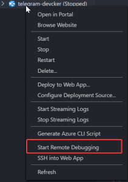
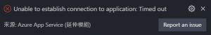

最近在做Telegram的bot，想說可以順便練習azure，所以就去申請了一個azure一年的免費額度來用，整體來說我覺得azure是個不錯的服務，不過價錢相對比較貴也是事實

但是實做到一半的時候發現，當我把程式佈署上去之後，我會看不到線上的log，雖然說程式都是在本地處理完沒問題才會推上去azure佈署，但是萬一出問題，還沒有log可以看，我覺得這會增加很多debug的成本

之後我在vscode的azure介面有看到一個start remote debug



於是我就直接點下去，點下去之後看了下方的console一直跑出無法連接的訊息

```shell
[Tunnel] Checking status, body: {"port":2222,"state":"STARTED","canReachPort":false,"msg":"Unable to connect to WebApp"}
```

之後就直接說失敗 

於是我又爬文，原來是要啟動的時候azure的容器會指定一個inspect的port，我們只要把這個port告訴給nodejs讓程式知道說log要到這邊，這樣就可以正常使用remote debug的功能

### 實際做法

這邊看你是怎麼啟動你的程式，不過作法大同小異，我是用npm run start來啟動，所以我只要在啟動的指令下新增這個參數就可以

```shell
--inspect=0.0.0.0:$APPSVC_TUNNEL_PORT
```

至於$APPSVC\_TUNNEL\_PORT這個參數可以在[官方啟動容器的code](https://github.com/Azure/azure-functions-docker/blob/master/host/2.0/stretch/amd64/appservice/start.sh "官方啟動容器的code")裡面找到

像我這邊的話就會是這樣

原本:

```json
"scripts": {
    "start": "cross-env NODE_ENV=production node ./src/app.js"
  }
```

加上去:

```json
"scripts": {
    "start": "cross-env NODE_ENV=production node --inspect=0.0.0.0:$APPSVC_TUNNEL_PORT ./src/app.js"
  }
```

這樣子再把程式部屬上去就可以用remote debug正常看到log了