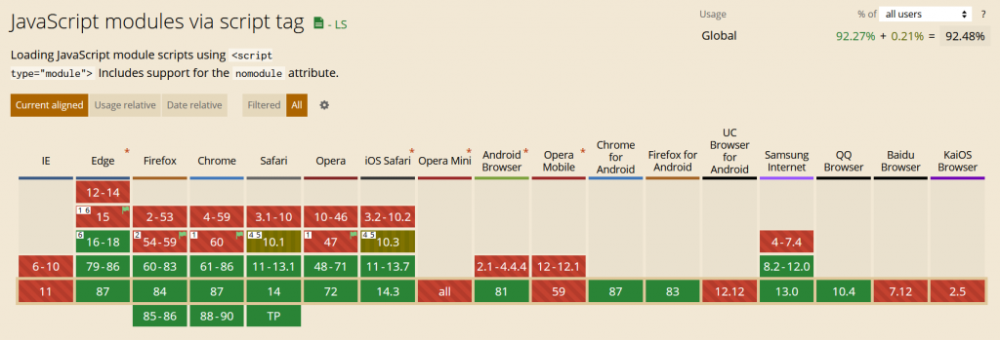

分享一下我平常開發瀏覽器插件的時候常用來優化架構的方式，並做個筆記，讓自己以後可以比較快想起來


## 使用打包工具

第一種方式就是使用像webpack這種的打包工具，這部分我有在另一個文章有分享過，有興趣的可以點過去看看

[使用webpack強化chrome瀏覽器套件的開發體驗](https://blog.devcker.com/extenision-webpack-enhance-experience/ "使用webpack強化chrome瀏覽器套件的開發體驗")

## 使用type="module"的script

第二種方式就是用現在瀏覽器就原生支援的type="module"，用這個最大的好處就是你不用去配置各種環境，馬上就能進行開發，缺點就是你程式碼都要包裝成esm的格式，不過我自己是滿習慣這種開發方式，雖然這樣做不太好利用到npm的生態系，但非常的方便，而且不會讓整個架構胡再一起，在做小專案的時候我都用這種方式

[](https://caniuse.com/es6-module "")

而且主流可以裝插件的瀏覽器都支援這個方式（終於不用考慮IE^^）

* * *

### 在background使用

在background使用最簡單的方式就是你把extension的background入口指定成html，html內再把你的script加上type="module"，這樣你整個background的環境就可以用esm的方式包裝你的模組

首先建立一個html檔案，檔名隨便，反正等下指向的時候取什麼名字就指向什麼，我習慣叫做background.html

然後新增你的script，type給他module，放到body或head內，這樣瀏覽器就會把你的script當成es module來看

像是這樣

> <script type="module" src="background.js"></script>

然後在manifest.json的background選項加上page參數，參數指向上面的html檔案

```json
"background": {
    "page": "background.html"
}
```

這樣子就完成background的設定了，在popup或者option內都能這樣做，但是content\_script由於不能指定他是type="module"，所以做法不一樣，這個稍後在講

* * *

### 現在你可以試試看esm的魔力

跟著做以下範例

util.js

```javascript
export function hello() {
    console.log("Hello world")
}

export function sayHello(name) {
    console.log(Hello ${name})
}

export default {hello, sayHello}
```

background.js

```javascript
// 這邊路徑要看你util.js放哪裡
import {hello, sayHello}, util from "./util.js"

hello()
sayHello("The World")

util.hello()
util.sayHello("Jojo")
```

順利的話裝完插件打開background的console就會看到印出四行字

* * *

### 在content script中使用esm模組

在content script中比較麻煩，由於他只能直接掛上去，沒有script可以改，所以要繞一下

通常來講有兩種方式，第一種就是你用content去建立一個script tag插入到document中，這樣你就可以指定他是type="module"

第二種方式就是dynamic import用動態的方式去載入模組

* * *

#### 1\. 建立一個type=module的script tag

content.js

```javascript
const url = chrome.extension.getURL("./content.esm.js")

const script = document.createElement("script")
script.type = "module"
script.src = url
document.body.append(script)
```

content.esm.js

```javascript
import util from "./util.js"

util.hello()
```

就像上面這樣，你把要執行的邏輯放到content.esm.js然後透過content.js去注入到document內

這樣做的缺點是，由於的你程式碼是注入到網頁的執行環境上，所以你不能用瀏覽器的runtime API，你要跟background通信就需要在content.js那邊再用一層之類的

而且由於他是要放到網頁上載入的，你的content.esm.js就還必須在manifest.json定義web\_accessible\_resources這個參數，不然瀏覽器不會讓你去讀取他

* * *

#### 2\. 使用dynamic import動態載入esm模組

這個方式也是我自己比較喜歡使用的方式，主要是因為我就不用再包一層通訊，而且也能直接使用瀏覽器的API

動態載入就是用import()這個方法來載入你的esm模組，建議可以搭配async來使用，使用體驗非常好

content.js

```javascript
async function useImport() {
    const util = await import("./util.js")
    util.hello()

    // 如果是想使用export default出來的
    util.default.hello()
}

// or

import("util").then(util => {
    util.hello()
})
```

個人是建議搭配async來做使用，但是這種方式也有很大的缺點，那就是要搭配async的話，代表你的方法都要是async除非你不care同步問題，就算不用async直接用then去拿，你的程式碼結構就會被侷限在這種格式上面

而且最大的缺點就是每當我要某個方法內使用某個模組的時候，我就必須要呼叫import()來載入模組，你有好幾個方法要依賴這個模組你就每個方法都要用import()把她載入

我自己的解法是我在執行其他邏輯之前，把可能很多方法都需要用的模組都載入到全域變數上，這樣之後要用的時候直接取全域變數就好，不需要再載入

```javascript
function useImport() {
    window._modules.util.hello()
}

window.addEventListener("load", async () => {
  window._modules = {}

  window._modules.util = await import("./util.js")

  // 以下再做其他邏輯
  useImport()
})
```

只是這樣就如上看到的，你光要呼叫一個方法名字就有夠長，而且對於某些使用場景，這樣依賴全域變數也不是辦法

* * *

### 結論

總之我在工作或自己的專案上都使用第二種方式來載入content script的esm模組，如果有發現更好用的做法一樣會更新上來