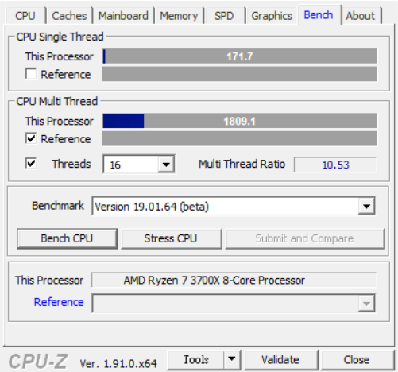

常常換個設備但是覺得還要找這些軟體很麻煩，所以想說寫個文章當個備忘錄來放自己常用的跑分 燒機軟體，這樣也之後要換什麼還是朋友想測試什麼我都直接丟這篇文章給他看就好，一方面也是防止自己忘記有哪些軟體可以用，如果有其他常用到的會持續更新

然後下面有些有數據的圖片都是我用這台電腦測的結果，也算是可以當個參考

##### [第一次組自己的AMD電腦分享 RYZEN 7 3700X](https://blog.devcker.com/unbox-self-amd-computer/ "第一次組自己的AMD電腦分享 RYZEN 7 3700X")

## [3DMARK](https://www.3dmark.com/zh-hant/ "3DMARK")

主要測試電腦的遊戲性能，還有就是可以測試DX12的效能，這款雖然要付費，但是因為STEAM滿常打折的，夏特冬特的時候都會很便宜，買回來可以測個夠本，建議直接放進願望清單

> 測試+跑分: CPU & GPU & 其他綜合效能 官方網站: [https://www.3dmark.com/zh-hant/](https://www.3dmark.com/zh-hant/) sTEAM: [https://store.steampowered.com/app/223850/3DMark/](https://store.steampowered.com/app/223850/3DMark/)

## [AIDA64](https://www.aida64.com/downloads "AIDA64")

這個應該大家都有聽過，可以做CPU單烤，記憶體測試，而且還有其他好用功能，一樣是付費軟體，但以這些功能來說我覺得不算貴

> 測試: CPU & 記憶體 & 其他部分 官方網站: [https://www.aida64.com/downloads](https://www.aida64.com/downloads)

## [CrystalDiskMark](https://crystalmark.info/en/download/ "CrystalDiskMark")

這是硬碟跑分軟體，同時也可以確認SSD有沒有做好4k對齊，免費軟體下載就可以直接測試

> 跑分: 硬碟 官方網站: [https://crystalmark.info/en/download/](https://crystalmark.info/en/download/)

\[adinserter block="4"\] \[adinserter block="9"\]

## [Cinebench R20](https://www.microsoft.com/zh-tw/p/cinebench/9pgzkjc81q7j?activetab=pivot:overviewtab "Cinebench R20")

跑分軟體，可以測試CPU的性能，支援多核跟單核分別測試，還有你可以跟別人同型號的CPU來比較跑分差距，如果差太多那可能就是有問題，而且是免費軟體，不過取得方式比較特殊，windows的在微軟商店，mac在apple store

> 跑分: CPU 官方網站: [https://www.maxon.net/en-us/products/cinebench-r20-overview/](https://www.maxon.net/en-us/products/cinebench-r20-overview/) 微軟商店: [https://www.microsoft.com/zh-tw/p/cinebench/9pgzkjc81q7j?activetab=pivot:overviewtab](https://www.microsoft.com/zh-tw/p/cinebench/9pgzkjc81q7j?activetab=pivot:overviewtab)

## [CPU-Z](https://www.cpuid.com/softwares/cpu-z.html "CPU-Z")

很常用的軟體，可以查看CPU跟記憶體的型號跟一些詳細資料，再來就是他可以跑分，一樣也是分單核多核，測完一樣可以跟別人的結果作比較

> 跑分: CPU 官方網站: [https://www.cpuid.com/softwares/cpu-z.html](https://www.cpuid.com/softwares/cpu-z.html)

## [FurMark](https://geeks3d.com/furmark/downloads/ "FurMark")

俗稱的甜甜圈，主要測顯示卡穩定性，我自己換新的顯示卡都會用這個軟體燒個0.5~1小時，來確定這張顯卡在高負載的狀況下不會出事情

> 燒機：GPU 官方網站: [https://geeks3d.com/furmark/downloads/](https://geeks3d.com/furmark/downloads/)

## [OCCT](https://geeks3d.com/furmark/downloads/ "OCCT")

OCCT主要測試電源的穩定性，還有就是燒機，一樣是免費軟體，我換新電源跟換新顯卡也會拿這個軟體來跑一下

> 燒機: Power + 整體穩定性 官方網站: [https://www.ocbase.com/](https://www.ocbase.com/)

## [7-zip](https://www.7-zip.org/ "7-zip")

7-zip雖然是壓縮軟體但他自己有效能測試的功能，所以就還是會拿它來跑一下分，是測試CPU的部分

> 跑分: CPU 官方網站: [https://www.7-zip.org/](https://www.7-zip.org/)

\[adinserter block="4"\] \[adinserter block="9"\]

## [V-Ray 5 Benchmark](https://www.chaosgroup.com/vray/benchmark "V-Ray 5 Benchmark")

V-Ray可以是一個測試渲染跑分的軟體，他可以只跑cpu或只跑gpu或兩個一起跑，跑完之後可以上傳上去，還能順便看看別人的分數

> 跑分: CPU + GPU 官方網站: [https://www.chaosgroup.com/vray/benchmark](https://www.chaosgroup.com/vray/benchmark)

## [Corona Benchmark](https://corona-renderer.com/benchmark "Corona Benchmark")

這套一樣是渲染跑分的軟體，使用方法就是載完之後打開它就會開始跑了，等一段時間之後結果就會跑出來

他網站上一樣有其他人的跑分結果可以參考

> 跑分: CPU 官方網站: [https://corona-renderer.com/benchmark](https://corona-renderer.com/benchmark)

## [blender benchmark](https://opendata.blender.org/ "blender benchmark")

blender自己是一個做3D模組的軟體，但他有另外出一個跑分用的軟體，可以跑CPU+GPU的渲染跑分，他有六個跑分項目可以選，但一個項目都要跑一段時間，如果六個都選就需要等久一點才會有結果

> 跑分: CPU + GPU 官方網站: [https://opendata.blender.org/](https://opendata.blender.org/)

## [Basemark](https://www.basemark.com/benchmarks/basemark-gpu/ "Basemark")

Basemark主要測是顯卡在Vulkan、OpenGL、DX12中的效能，一樣是免費使用，載下來裝一下，馬上就能測試

> 跑分: GPU 官方網站: [https://www.basemark.com/benchmarks/basemark-gpu/](https://www.basemark.com/benchmarks/basemark-gpu/)