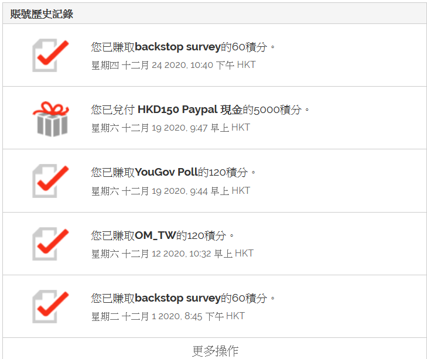
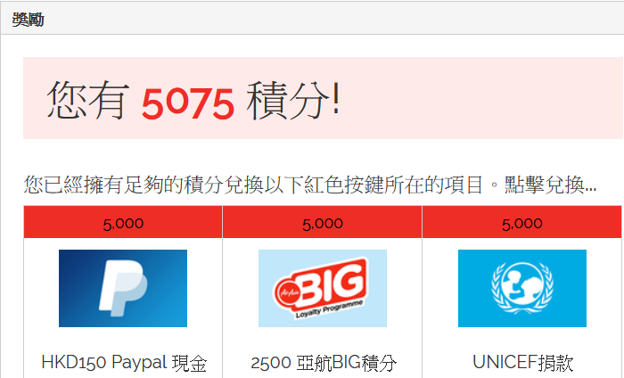
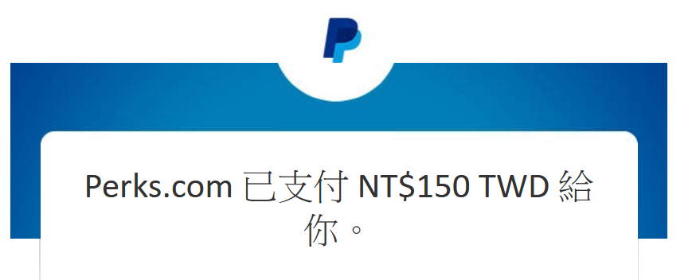
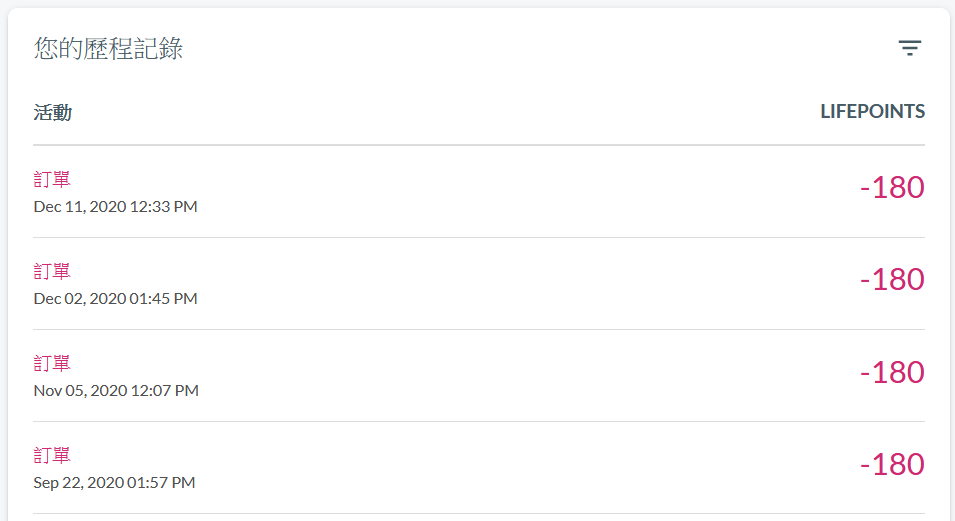
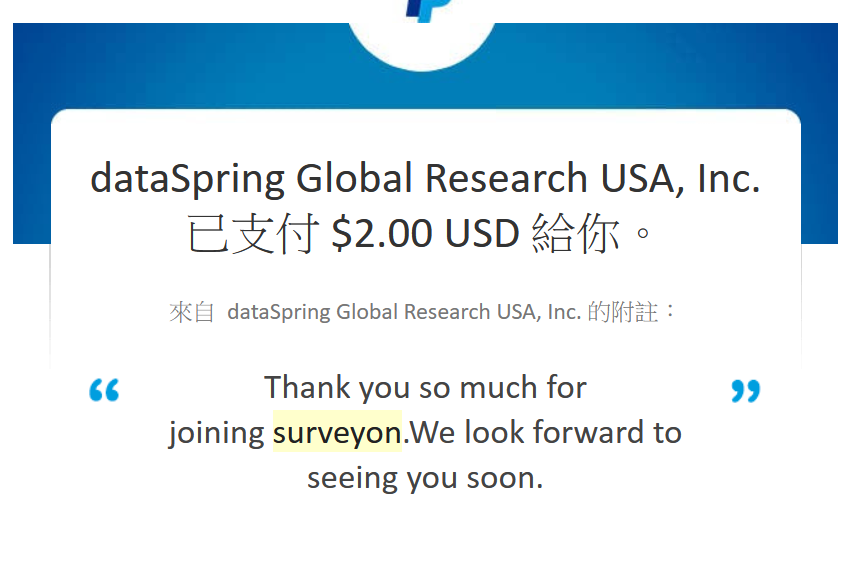
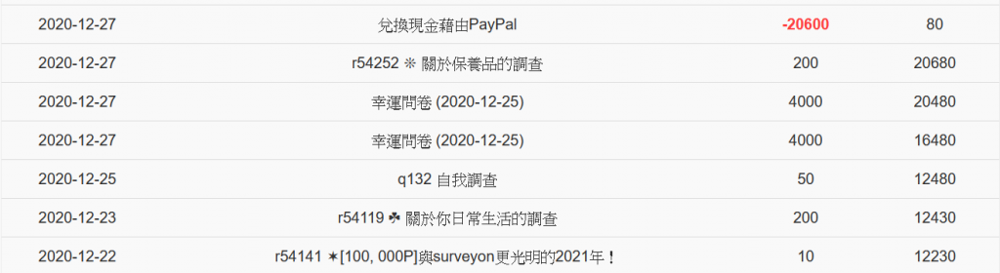
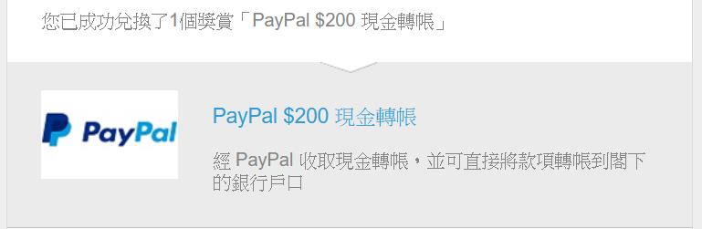
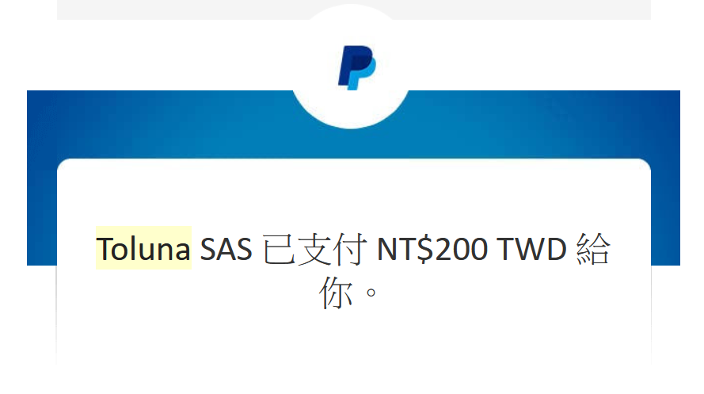
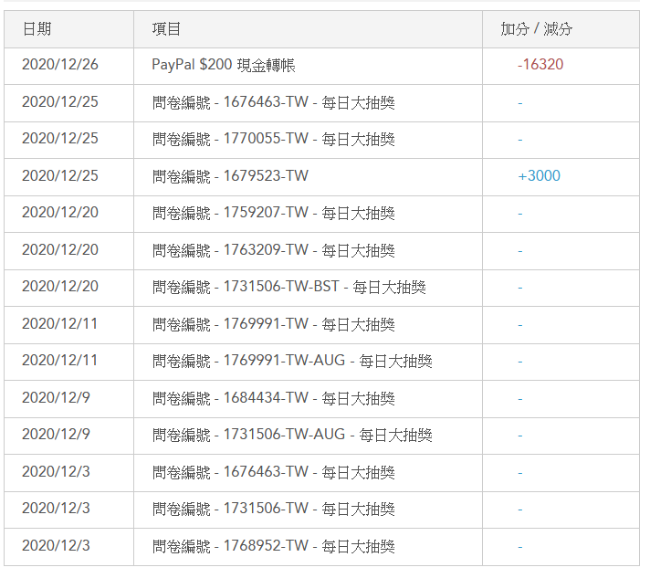
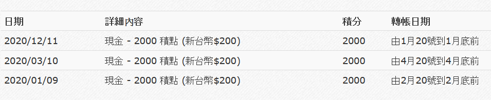

分享一下自己在今年有出金且比較好做的問卷網站，大家可以參考看看，順便當成之後推坑朋友的懶人包，列表中介紹的幾乎都是paypal出金，所以可能需要去辦一個paypal帳號

## [YOUGOV](https://hk.yougov.com/zh-hk/refer/XU5ED0cgycmbltdYlIDvqA/ "YOUGOV")

這個問券網站是香港的網站，出金是寫港幣但是真正轉過來是台幣，以下付出金的截圖

這網站的問券數量不算多，就算你把他的問券頻率調到越多越好，大概一個月多一點可以收到四次，少一點就只收到一個問券

但是會推這間不是沒原因，因為他問券很好填，都是問一些簡單的問題，不像其他問券網站會問一堆有的沒的，基本上１０分鐘內都能解決，我認為是很友善的問券網站

另外他是5000點出金一次，出金一次150港幣，我最近一次都到是用台幣550轉PAYPAL給我，每次都有做的話，大概半年到一年可以出金一次

如果有興趣可以用我的推薦連結註冊帳號開始使用

> [YOUGOV網站連結](https://hk.yougov.com/zh-hk/refer/XU5ED0cgycmbltdYlIDvqA/ "YOUGOV網站連結")

## [LifePoints](https://www.lifepointspanel.com/ "LifePoints")

這個網站看起來是一家英國公司，我推薦他的原因是因為他問券數量很多，而且出金門檻很低，平均都有做的話，一個月可以出金一到兩次或以上

附上他的出金截圖

他的出金門檻是180點可以換150台幣，平均一個問卷就會給30點數，這家也是我最常出金的網站，非常好用

> [LifePoints官方網站](https://www.lifepointspanel.com/ "LifePoints官方網站")

## [surveryon](https://www.surveyon.com "surveryon")

這家一樣是國外的問券網站，出金程度僅次於LifePoints，一樣問卷數量多，出金門檻是20000點一次可以換2美金

這家的獎勵就沒LifePoints好，但是問券數量多，所以一樣也是大概一個月可以出金一次

平均一個問卷2000~4000左右，所以大概做完6~8個問券就能出金，一樣是很推薦的一個問券網站

> [surveryon網站連結](https://www.surveyon.com "surveryon網站連結")

## [Toluna](https://tw.toluna.com/referral/kami25565 "Toluna")

這個網站很久以前是我很喜歡用的問券網站，但最近幾個月用下來，他問券數量變少，加上好像很多人知道這網站，所以常常下班來填問券就會跟你說問券數量已經額滿，或是問券填一填容易就是不是他們要找的客群，所以填的問券很容易失敗

但這家依然是推薦的，原因是他出金門檻不算高，可以多少賺一點，加上他不時會辦一些活動可以抽點數，我覺得他在社群經營上這點還不錯

以下是他的出金截圖

他的出金門檻是16320點可以換台幣200塊

這家我比較推薦給學生或平常比較有空可以賺零用錢的人，上班族的話就像我上面說的，一回家打開要填的時候，常常就會已經額滿

如果有想要開始賺這家網站的零用錢的話可以用的我推薦連結註冊喔!

> [Toluna網站連結](https://tw.toluna.com/referral/kami25565 "Toluna網站連結")

## [Rakuten Insight](https://tw.m.aipsurveys.com/ "Rakuten Insight")

台灣樂天的填問券服務，跟以上幾家不同的是，他的出金是直接匯到你的戶頭，而不用透過paypal

問券數量中等，問券也算好填，他的出金門檻是2000點換台幣200

加上他是直接匯到你的戶頭，還不用申請玉山的戶頭跟省下paypal轉到玉山帳戶的手續費，我認為這是他最大的好處

然後他有另一個出金方式是直接轉成台灣樂天的點數，最低500點就可以轉換成50點樂天點數，然後台灣樂天點數還能轉換成日本樂天點數

然後日本樂天點數可以用R PAY去mora或onkyo換歌，根本就是完美combo，這也是目前主要用他的原因

> [Rakuten Insight網站連結](https://tw.m.aipsurveys.com/ "Rakuten Insight網站連結")