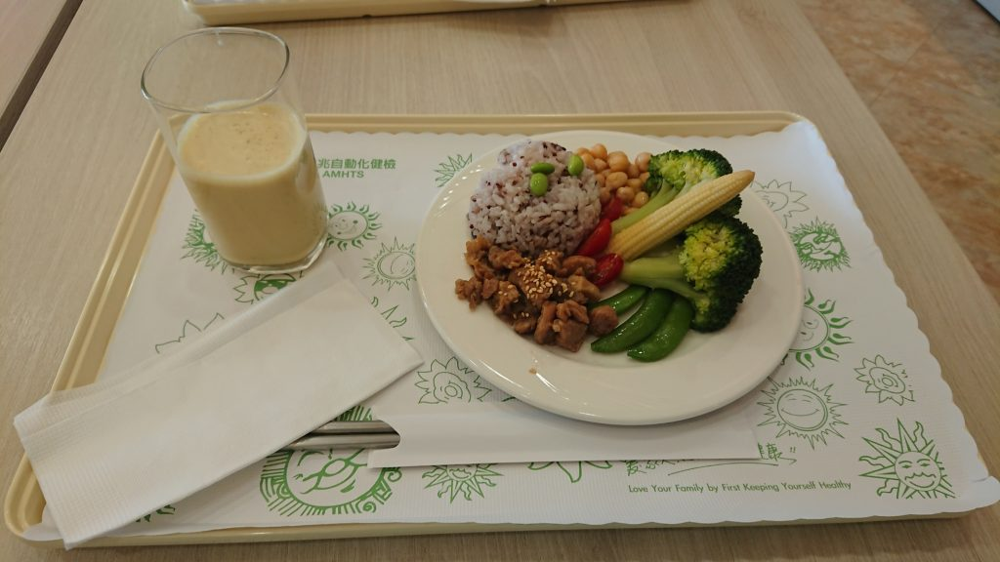

因為公司有補助健檢的關係，所以第一次做外面的健檢,上次健檢已經是一年以前當兵的健檢了，分享一下這次健檢的經歷

基本上裡面的護理人員很親切，整個過程很順暢，我還以為會跑來跑去，結果坐在裡面的時間還比較久，每個項目都滿短的，做一下就出來了

因為是公司補助的健檢，所以要去檢查的一個禮拜以前，公司會發一袋東西，裡面包括採集糞便的東西，還有就是一些資料要填

到了當天之後，由於我是早上的，所以大概八點半以前就要過去報到開始做檢查，到了現場之後就是開始給資料，然後會要你穿上他們的衣服

第一站我記得是抽血，上次抽血已經是當兵的時候了，所以有點緊張，還好醫護人員很親切，抽完血之後就是開始量身高體重然後一些體脂，X光之類的項目

大概幾個項目做完他會請你去用餐，菜色我覺得很不錯，有菜有肉跟一個活力飲料，活力飲料好像是依照每個人身體去調整的

吃完餐之後一樣就是等待檢查剩下的項目，等的時間還滿久的，還好是可以帶手機出來，不然可能會很無聊在那邊坐著

整個檢查完成之後，會請你去把衣服換回來，然後就會有一個醫生來講解你今天檢查的結果，要少吃糖阿，還是哪邊數值太高要注意，或者如果不改善可能會引發一些疾病之類的，就是大概這些的建議

講解完之後就是去櫃台結帳了，這邊結帳是可以刷卡的，這點對我來說真的滿方便的，然後會把你今天檢查的資料放在信封裡面給你，詳細的資料過幾天會寄到你之前在資料裡填的地址

整體下來大概從8點到11點20分左右，差不多一個早上就過了，我覺得很滿意，如果明年健檢也是這間的話可能會多檢查一些項目