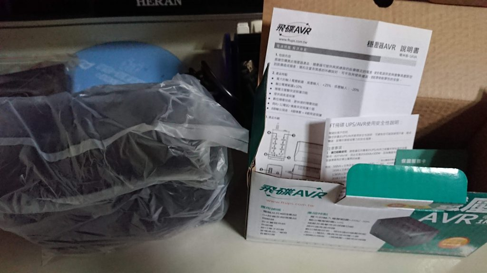

之前就因為家裡面的電燈開關會導致我的螢幕會閃黑，長期下來真的不是辦法，所以我上網找了一下原因跟解法，發現可能是家裡市電老舊所以可能電流不穩所導致的，後來就上網找了一下解決方法，發現可以買穩壓器來解決這問題，我主要是要插螢幕用的，所以我就買了比較便宜1KVA的穩壓器

上網挑了一下就看到這款正在特價，所以就買了這款回家試試看了

[【【FT飛碟】 1KVA 三段全電子式穩壓器](https://product.mchannles.com/redirect_wa.php?k=2ebD5&tourl=https://www.momoshop.com.tw/goods/GoodsDetail.jsp?i_code=5946475&Area=search&mdiv=403&oid=1_1&cid=index&kw=ft%201kva)

下單之後，貨很快就到了，穩壓器還滿重的，應該有1公斤以上，感覺比我的筆電還要重 

馬上把他打開來看，裡面有說明書，保固卡，還有就是本體 

拆掉塑膠袋之後 本體大概長這樣 

他有8個插座可以用 分別是四個穩壓跟四個防突波，不過位置還滿近的，大一點的變壓器可能就會佔到兩格位置... 

然後我馬上把我的設備和螢幕插上去試試看，如圖所示光NS的變壓器就佔了兩格XD，不過這倒是沒關係，還要我沒有太多東西要插，插頭插上去之後他旁邊有個紅色電源開關按一下就啟動了 

## 結論

看別人說如果市電不穩，他燈號會是橘色的，但我這邊都是綠色的感覺市電很穩，試了一下閃黑的問題，結果發現好像不是市電的問題XD，不過心想可以幫忙防突波也是好，畢竟是特價買的，心也沒那麼痛，只是這個閃黑的問題我可能還要另外找到解決辦法了QQ

2020/11/3更新

最後解決了.....[我的解決辦法](https://blog.devcker.com/resove-screen-fresh/ "我的解決辦法")