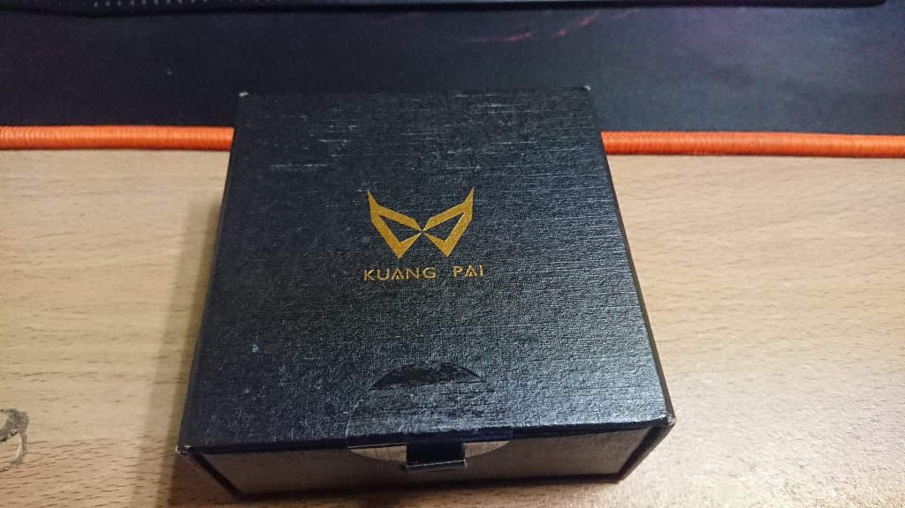
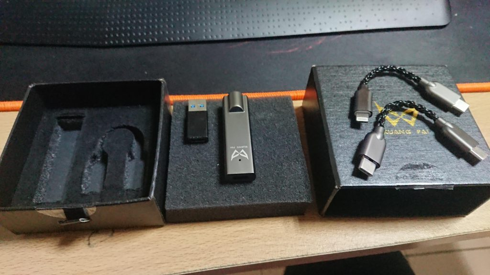
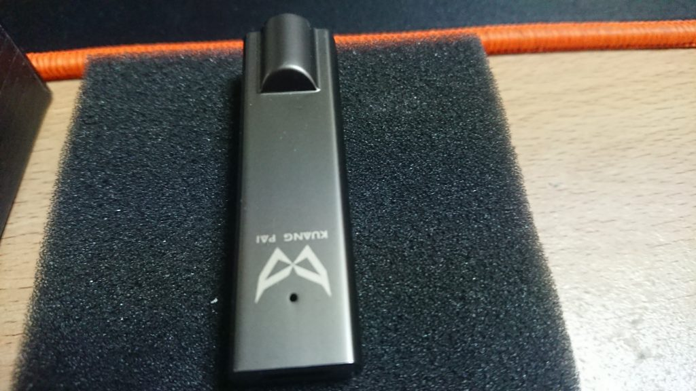
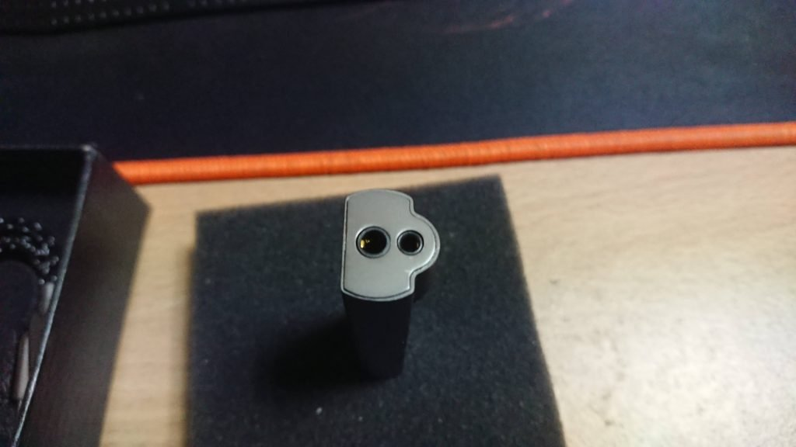

最近在想入耳機坑這麼久也是時候來買小尾巴了，但因為疫情的關係所以就不太能去耳機店試聽，所以只能爬文雲試聽了XD，後來挑來挑去就選了這支狂派PLUS2，主要是因為他自己有2.5平衡孔可以用，之後要升級線也是很方便

## DAC本體

狂派PLUS2的盒子就小小的，如圖所示就是一個簡單的黑色盒子，上面印有狂派的LOGO

裡面的配件就是狂派PLUS2自己跟三個轉接頭，分別是type-c轉type-c、轉蘋果規格type-c轉lighting，還有一個應該是讓你接電腦用的USB-A otg

本體就長這樣，小小隻的，大概跟食指差不多常而已

然後就是他有支援3.5mm跟2.5mm平衡

## 實際使用聽感

這隻是我第一隻小尾巴，所以我也不太能比較其他小尾巴的聲音，只能說說跟直推的差別

以下都是我在公司用這隻狂派PLUS2推下面幾隻耳機一個禮拜的心得，但是我沒有2.5的平衡線所以下面都是用3.5來測試，等之後有2.5的線我再來補充平衡的部分

### [Final A4000](https://blog.devcker.com/unbox-final-a4000/ "Final A4000")

先來說說[a4000](https://blog.devcker.com/unbox-final-a4000/ "a4000")在用這隻小尾巴推的情況下的差別，因為聽說[a4000](https://blog.devcker.com/unbox-final-a4000/ "a4000")是比較需要推的，雖然直推的時候我覺得聲音就滿不錯的，但我還是想發揮[a4000](https://blog.devcker.com/unbox-final-a4000/ "a4000")的潛能

首先第一個印象是，解析度變高，然後高頻延伸更遠，聲音更立體，還有就是人聲這塊更突出了，中高頻這塊整個凸出來xd，低頻的部分我覺得有比較Ｑ但是跟直推比差距不太大

不確定中高頻凸出來這部分是[a4000](https://blog.devcker.com/unbox-final-a4000/ "a4000")本來上擴就會這樣還是狂派plus2有特殊加成，不過整體來說我覺得升級感滿大的，因為[a4000](https://blog.devcker.com/unbox-final-a4000/ "a4000")我就是買來聽流行樂跟女聲的，所以我覺得整個就上了一層BUFF

#### 2021/09/25 更新　我買平衡升級線了ＸＤ

我因為這條小尾巴所以買了一條2.5平衡升級線，有興趣的可以點擊連結去看一下，這篇就不贅述這部份了

[微開箱 HanSound 漢聲 無氧銅鍍銀 24AWG 升級線](https://blog.devcker.com/unbox-hansound-mavis-24awg-wire/ "微開箱 HanSound 漢聲 無氧銅鍍銀 24AWG 升級線")

### [Denon C820](https://blog.devcker.com/unbox-denon-ah-c820/ "Denon C820")

這隻是我拿來聽金屬跟搖滾的耳機，直推就可以發揮非常不錯的聲音，直到我前幾天在ptt耳機版上看到有人說[C820](https://blog.devcker.com/unbox-denon-ah-c820/ "C820")沒上擴只有發揮30%，我看到這段話心想，這麼好聽的聲音竟然才發揮3成，這段話也是我會想去買小尾巴的主要原因之一XD

拿到狂派PLUS2的第一步，我就馬上把[C820](https://blog.devcker.com/unbox-denon-ah-c820/ "C820")拿過來插進去試試看，第一首歌的第一個印象就是，吉他的刺激感好像沒有直推那麼爽，但是鼓跟BASS馬上就凸顯出來，還有就是人聲的部分也是整個圓潤了不少

感覺用了狂派PLUS2之後拿來聽金屬好像沒有直推的爽，但是他這個特性我就拿來試試看硬搖滾，發現相性非常的合欸，整個氣氛都更上了一層，真的是很不錯

雖然拿來聽金屬會感覺少了些什麼，但是拿來聽搖滾真的很不錯，剛好有點補足了[C820](https://blog.devcker.com/unbox-denon-ah-c820/ "C820")在直推下的一些缺點

後來我又試了JPOP跟一些動畫歌，發現也是變得比較好聽，主要是因為聲音更暖了，所以聽起來更滑順，加上狂派之後[C820](https://blog.devcker.com/unbox-denon-ah-c820/ "C820")變得有點萬能XD，這邊就要回到網友說的只發揮30%這句話，我聽完之後非常認同，雖然金屬的刺激感變少令我滿震驚的，但是拿來聽其他曲風的音樂就變得更順耳了

## 結論

我認為狂派plus2在音色上有比較偏現代人的口味，感覺有稍微強調中高頻的部分，但整體來說還是滿乾淨的，主要都還是耳機在發揮，我覺得還算不錯

不過有點可惜的是我沒有2.5的線可以聽QQ，以後有換線的話[A4000](https://blog.devcker.com/unbox-final-a4000/ "A4000")那部分我會再補一些平衡的聽感(好像換線阿QQ)