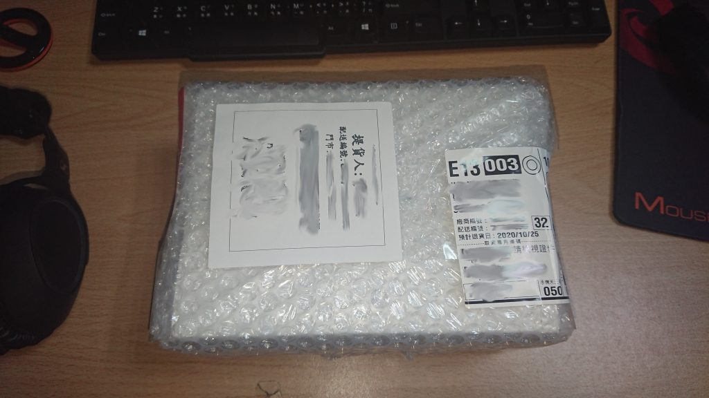
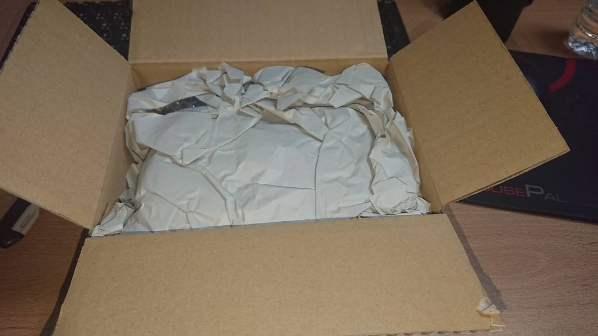
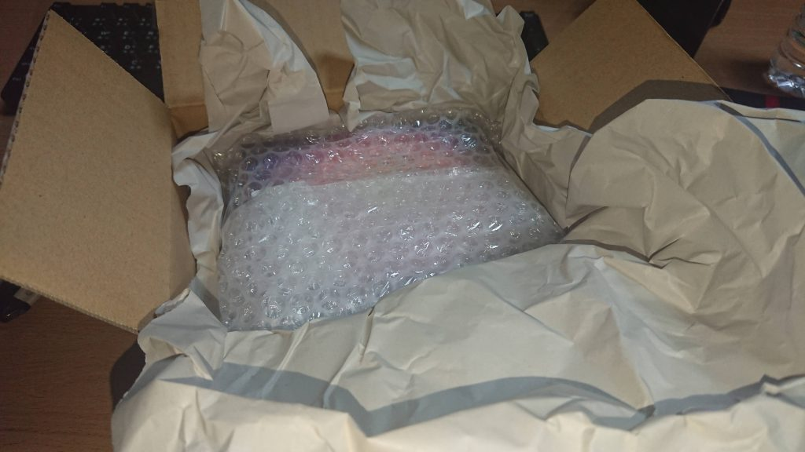
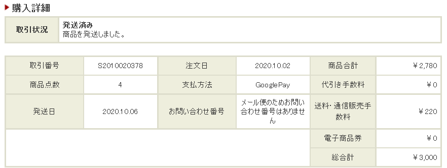
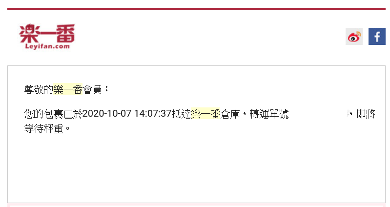
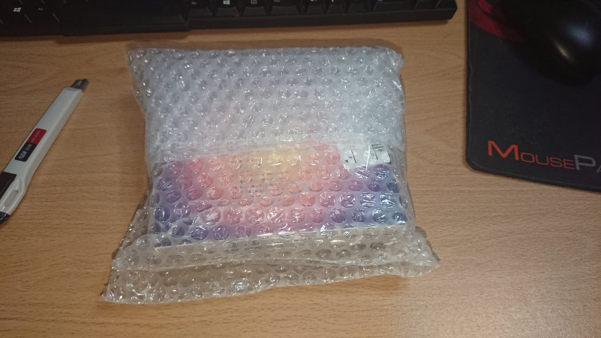
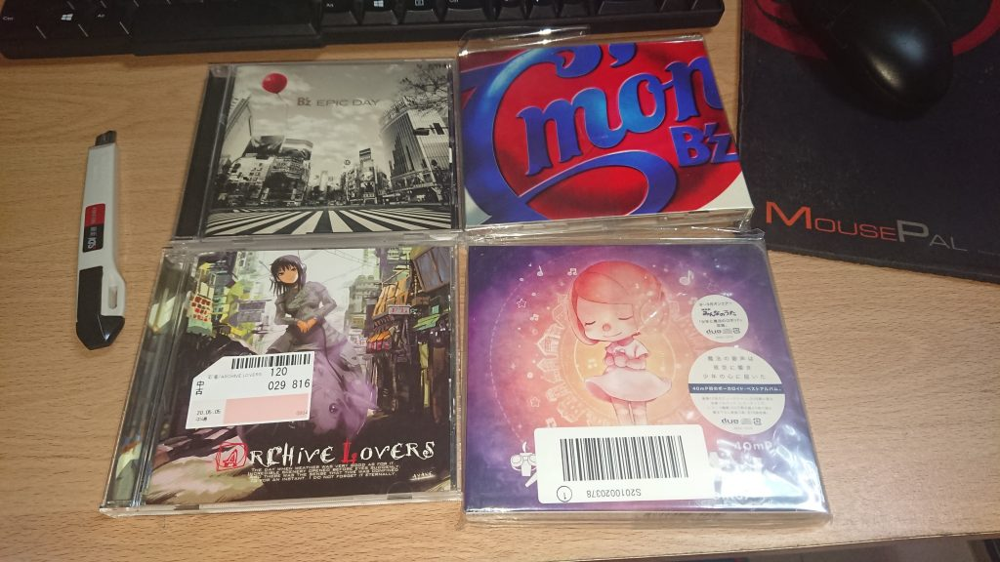

我已經買第二次了，也能參考這篇：[第二次用樂一番轉運使用體驗](https://blog.devcker.com/second-time-used-leyifan-experience/ "第二次用樂一番轉運使用體驗")

最近因為想買的專輯在台灣買二手的有點貴或者根本買不到，所以開始找從日本買專輯的辦法，而且我平常工作家裡根本沒人，所以想要可以送到超商，找了各種代購跟代運找到了樂一番，剛好活動中送到超商還有活動可以折抵一些運費，所以就試試看

[樂一番](https://www.leyifan.com/s/aV684h "樂一番")應該是我找到最符合我需求的，因為其他家都沒有送到超商，都只能直接送到家，不然我就直接日亞訂下去了xd，剛好也有活動就試試看第一次的購物體驗

## 運費

最重要的運費因為活動的關係，所以我只要不買超過一公斤，他送到超商的運費加手續費就是950日圓，大概台幣260塊左右，不過這活動好像只有一個月的樣子，所以我算運氣好有跟上活動

## 購物流程

首先他註冊之後會給你一個日本地址，你只要在日本買的東西都能送到那個地址，那邊會有人幫你簽收，只要簽收或入庫他都會發簡訊跟email通知你要不要進行合箱或出貨

然後申請合箱的時候他會有一些加值服務，像是加300日圓可以幫你做簡易加固，我自己是有申請不過知道哪邊是加固過的送過來的箱子大概長這樣，整個包的滿滿的

## 整個購物加運送時間

我總共從日本駿河屋買了四張專輯，10/2下單，10/6出貨，隔天就送到了[樂一番](https://www.leyifan.com/s/aV684h "樂一番")的倉庫，原本過兩天還沒出貨我還在擔心，上網查了一下原來駿河屋出貨本來就比較久，大家都過幾個禮拜才出貨，我也算是運氣不錯的了... 

到了之後她會寄email跟簡訊告知你

之後就是申請出貨跟選加值服務，申請完成後大概到10/13他就會通知已經完成發貨程序要你去付運費，付完運費之後隔天10/14他就會通知已經發貨上飛機要運過來台灣了

又到了隔天晚上10/15，EZWAY的APP就會通知有貨物入關要確認是否正確，看完之後沒問題我就直接允許了

之後就進到台灣的物流流程了，到10/18終於送到超商

期間經過了大概16天，駿河屋花了四天出貨，然後樂一番出貨流程加上運送花了大概12天，雖然沒有說很快，但我自己是覺得滿可以的，因為他這個快捷方案跟EMS不同一個禮拜只有兩天發貨到台灣，所以感覺上是比較久

## 整體花費

買四張專輯總共花了3000日圓，然後運費+手續費950日圓，然後我自己有用加值服務多了300日圓

> 3000+950+300 = 4250JPY 大概1160台幣

我自己是覺得滿划算的，而且有兩張台灣根本沒人賣二手

## 開箱

送來的商品大概是長這樣，該強化保護的都有包上去

商品拆開來看起來沒什麼太大的損傷

## 結論

有活動的時候我覺得可以用，各種優惠減免，比較推薦要買不會太重東西的人比較划算，而且太重超商也可能不活動的時候我覺得可以用，各種優惠減免，比較推薦要買不會太重東西的人比較划算，而且太重超商也可能不收

對了，發貨之前記得先身分認證，不然他不知道要怎麼報海關

另外最近發現他有個[日掏值得買的網站](https://guide.leyifan.com/cht "日掏值得買的網站")，他旁邊有個簽到，每天可以簽到一次，一次簽到會拿到一點，集到100點可以換折100日圓運費的折扣券，沒事也可以進去點點

有興趣的可以點這邊去[樂一番註冊](https://www.leyifan.com/s/aV684h "樂一番註冊")試試看

至於我買的這四張分別是

> [B’z / C’mon(初回限定盤)(DVD付)](https://amzn.to/3lwfH0u "B’z / C’mon(初回限定盤)(DVD付)")
> 
> [B’z / EPIC DAY](https://amzn.to/3kriczX "B’z / EPIC DAY")
> 
> [40mP / 少年と魔法のロボットVOCALOID BEST ，NEW RECORDINGS](https://amzn.to/35vd7T2 "40mP / 少年と魔法のロボットVOCALOID BEST ，NEW RECORDINGS") [(開箱文)](https://blog.devcker.com/unbox-vocaloid-album-40mp-magic-robot/ "(開箱文)")
> 
> [彩音 / ARCHIVE LOVERS](https://amzn.to/2UnVgH4 "彩音 / ARCHIVE LOVERS") [(開箱文)](https://blog.devcker.com/ayane-archive-lovers/ "(開箱文)")

這幾張專輯我也會另外寫個開箱文，不需要用超商的我覺得可以直接用日本亞馬遜買，這幾張買了我都很滿意的一直聽著