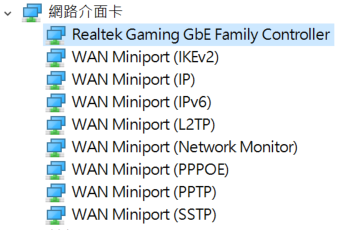
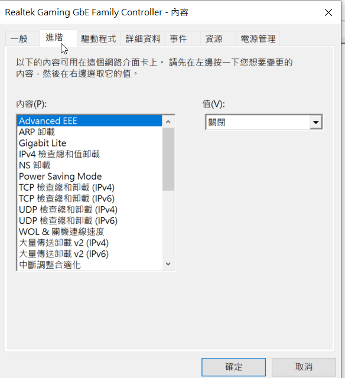
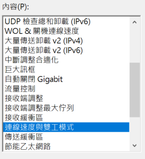
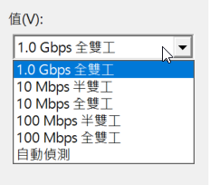

最近終於花了一筆錢換掉了用了10年的老電腦直接升級上去，但是這個時候問題就來了，網路好像還要比以前卡，以前看youtube都不會卡，現在不時地還會卡住讀取，fb跟一些網站的圖片預覽很慢才出現，我開始覺得不太對勁，所以開始爬文看有沒有一樣的問題

最一開始的時候，有找到很多都是組了新電腦，然後網速開始跑不到原本的水平，有些是主機板上晶片的問題，有些是cpu問題，有些好像是他自己沒設定好，但是找到的結果裡面幾乎都沒有跟我類似的，最後找到了一個叫做[TCPOptimizer](https://www.speedguide.net/downloads.php "TCPOptimizer")的軟體來解決網路卡頓的問題，我喜出望外趕快載下來試試看，照著網路上的教學設定，然後重開機

發現網路好像真的變快了，又用了一段時間發現，好像還是存在著某種瓶頸，雖然說卡頓的情況變少了，但還是會有，這時候我又再度去尋找問題，這次直接把我網卡型號帶下去找，最後在國外的網站上面找到解法，終於解決了我的問題。

我的主機板是[Asus TUF Gamming X570](https://product.mchannles.com/redirect_wa.php?k=2ebD5&tourl=https%3A%2F%2Fwww.rakuten.com.tw%2Fshop%2Fjt3c%2Fproduct%2F4718017388498%2F "asus tuf gamming x570")這張主機板上帶的網卡型號我在裝置管理員看是叫做realtek gaming gbe family controller

所以我直接把realtek gaming gbe family controller拿去餵google，後來在國外網站找到的解法就是去裝置管理員把連線速度與雙工模式的部分調到1.0Gbps 全雙工就解決了我的問題

## 1\. 先在裝置管理員找到網卡 打開他

## 2\. 選到進階的選項

## 3\. 左邊內容找到連線速度與雙工模式

## 4\. 值的部分依照自己網速選擇

我自己網速是300Mbps所以我是選1Gbps，這個部分應該是要看自己情況選擇

## 結論

調完之後按下確定，這時候重新連網應該就正常了，如果不正常再自己調回去原本的設定，至少這樣的做法我是解決我自己的問題了