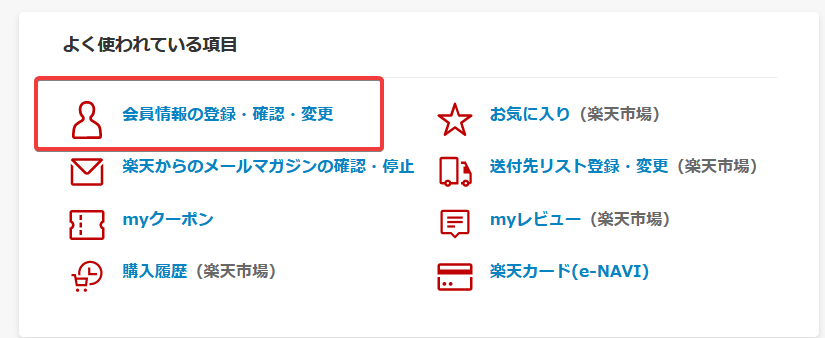
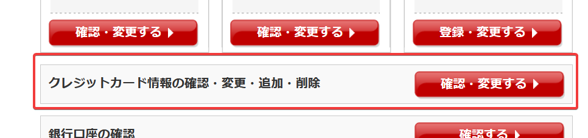
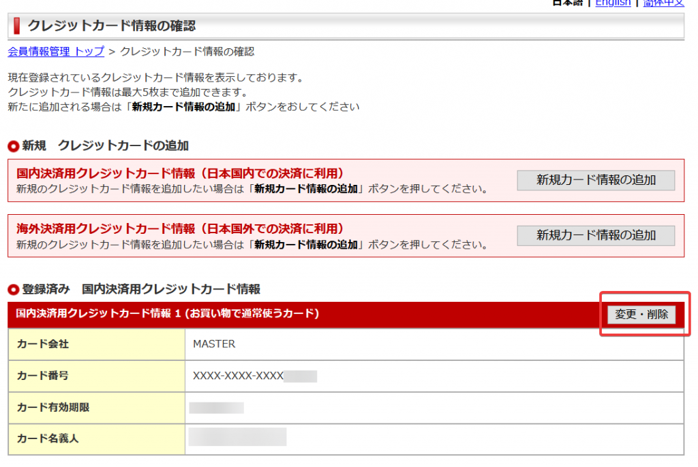
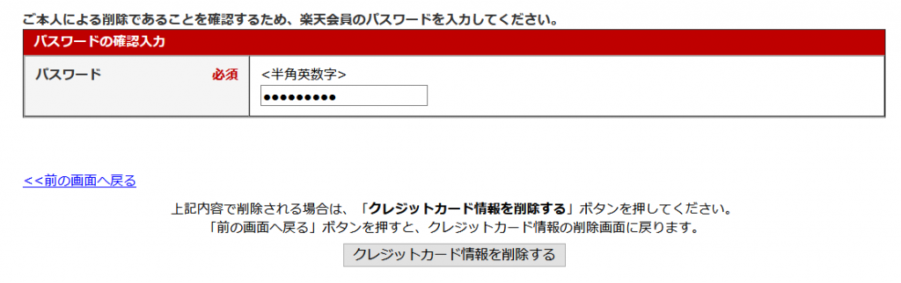
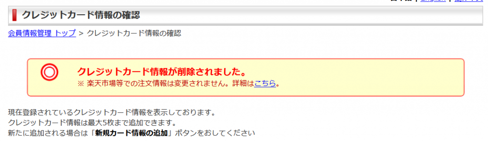

之前在mora買了歌之後，一直忘記把日本樂天的信用卡刪掉，我個人是習慣不留信用卡在網路上，但是第一次找的時候因為選項太多,所以找了一段時間，所以我乾脆寫一篇文章防止自己忘記，畢竟日本樂天的個人資料頁面資訊量有夠多

首先先進到個人資訊頁面 [https://my.rakuten.co.jp/?l-id=top\_normal\_myrakuten\_account](https://my.rakuten.co.jp/?l-id=top_normal_myrakuten_account)

然後點下面的按鈕，會進到編輯自己資料的頁面

然後選擇這個選項的按鈕，這邊是確認或變更信用卡的頁面

進去之後就會顯示你目前的信用卡，在你要刪掉的卡的右上角有一個按鈕，按下去

進去之後往下滑，會有一個地方要你打密碼，打完密碼之後直接點下面的按鈕

按下去之後他就會跟你說你的信用卡資料已經刪除了，到這邊就完成了