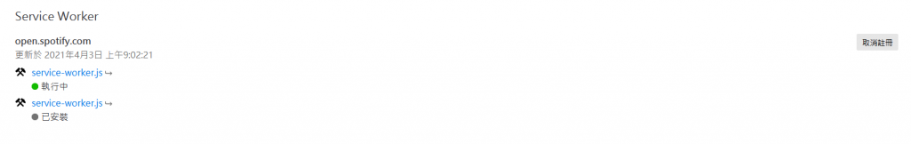

我自己是日常使用firefox當瀏覽器的人．之前就有遇到spotify的網頁版撥放器在firefox好像會讀取錯誤，之前就有研究一下，最近有朋友有遇到這問題，所以我乾脆寫篇文章上來紀錄

解決辦法很簡單，到spotify的網頁撥放器頁面按下f12或者去選項開啟開發人員工具

然後最上方的tab選擇應用程式，之後就會看到以下畫面 

這個就是spotify註冊的service worker，右上角有個取消註冊，按下去之後重整就正常了，雖然我不知到為什麼只有firefox會有這問題，但官方修復之前也只能這樣做了