最近因為原本的遊戲耳機有些問題，而且又有三倍券可以用，所以想要順便換個音樂耳機試試看，之後到處爬文，找了PTT，巴哈，mobile01的結果是到現場去試聽會比較準，所以上上個禮拜找個時間到建國路找了幾家店去試聽，人選大概有爬文先找好，所以就到現場直接找來聽，主要是想要在家裡方便聽，所以這次就以藍芽耳機的方向去找

## 抉擇

大概試聽了5~6支耳機，最後最難下決定的是[Sony WH-1000XM3](https://shopsquare.co/2iNVI "Sony WH-1000XM3")跟[Sennheiser PXC 550 II](https://shopsquare.co/2iNVH "Sennheiser PXC 550 II")

這兩支耳機我都很喜歡，特別是[WH-1000XM3](https://shopsquare.co/2iNVI "WH-1000XM3")的價格有夠香，戴起來又很舒服，低音也是試聽的耳機中最對味的，覺得真的是不錯的耳機

[PXC 550 II](https://shopsquare.co/2iNVH "PXC 550 II")的部分是我自己聽起來中高音的部分很舒服，加上體積又很小一個，又超級輕，還有那個耳罩有夠軟，自己是滿喜歡這種感覺，但是價格就沒有[WH-1000XM3](https://shopsquare.co/2iNVI "WH-1000XM3")那麼香

後來就回家猶豫了一個禮拜，上網爬了一下文發現[WH 1000XM3](https://shopsquare.co/2iNVI "WH 1000XM3")好像不能一次配對多個設備，因為我主要是要在家裡用的想要可以切換手機，電腦跟NS，然後PXC 550 II是幾乎沒有什麼文章可以參考，大家都是推WH-1000XM3，真的是一面倒推

最後決定了，就決定是[PXC 550 II](https://shopsquare.co/2iNVH "PXC 550 II")主要是因為我可能會想試試看大家討論度不高的商品，加上自己試聽的感覺真的不錯，然後聽的音樂都是中高音居多，再來就是自己已經有一個聲海的藍芽無線耳機[CX 6.00BT](https://easymall.co/2iNVJ "CX 6.00BT")，是拿來上班的時候拿來聽的，長期使用下來對這品牌也有了信心，所以就決定是PXC 550 II了，最後Sony那支最近也要出四代了，之後可能也會買來上班聽

決定了之後上禮拜就馬上去建國路上的聲海專賣店買了[PXC 550 II](https://shopsquare.co/2iNVH "PXC 550 II")，買的時候也有三倍券的活動，所以是用三倍券買的都會送一個收納包，然後是滿額會送一個頸枕，算是贈品滿滿

## 微開箱

### 贈品

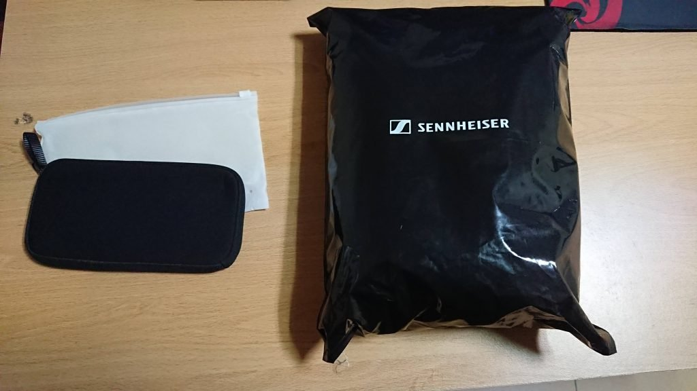

這些是從聲海官方店拿到的贈品，黑色包裝的是頸枕

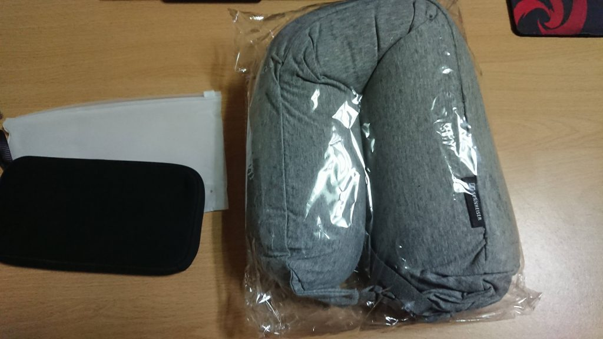

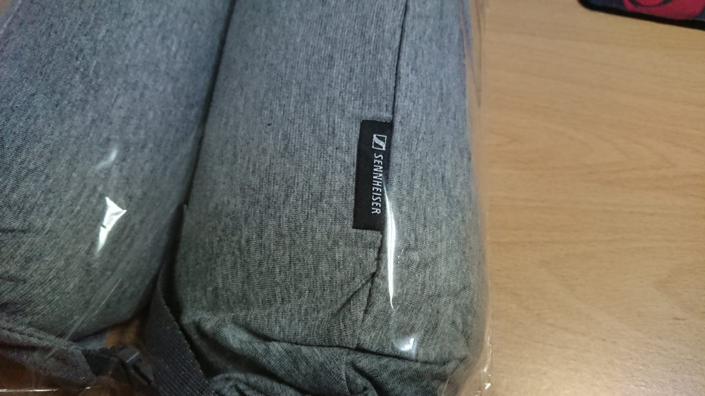

打開包裝後頸枕大改長這樣

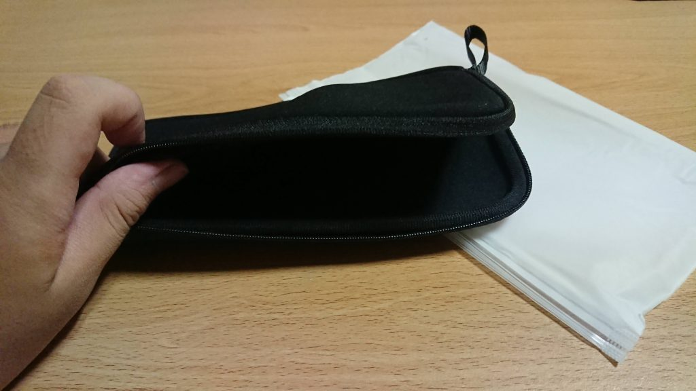

再來是用三倍券會送的收納包，就小小一個，然後是會有一些味道，拿到之後可能要曬一下

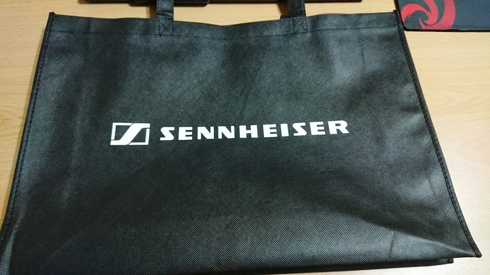

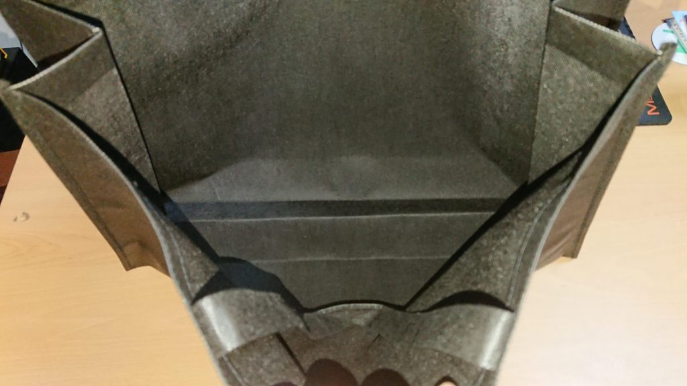

再來這個環保袋應該是買耳機都會有的環保袋，感覺還滿潮的，看起來也是滿大的

### 本體

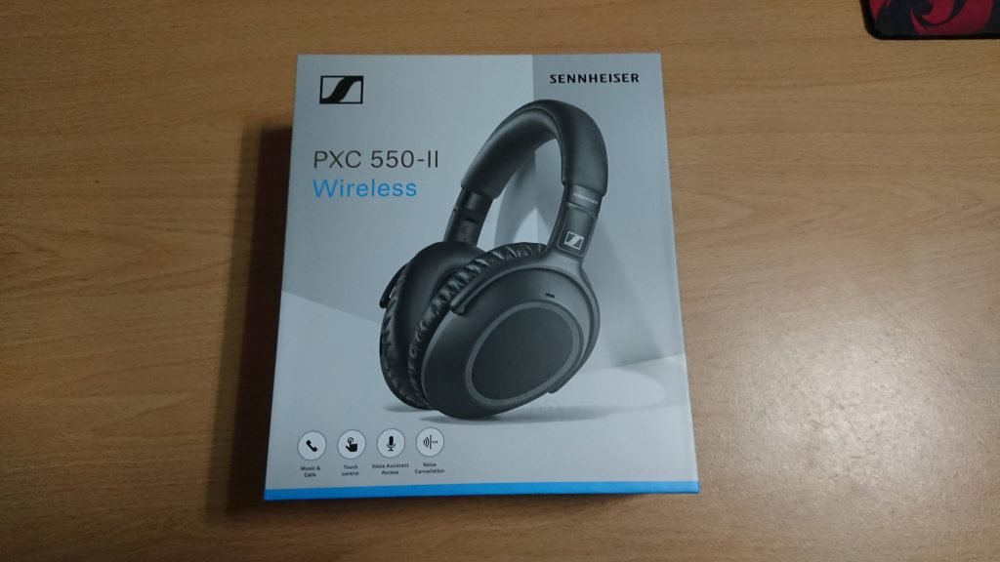

外包裝大概長這樣

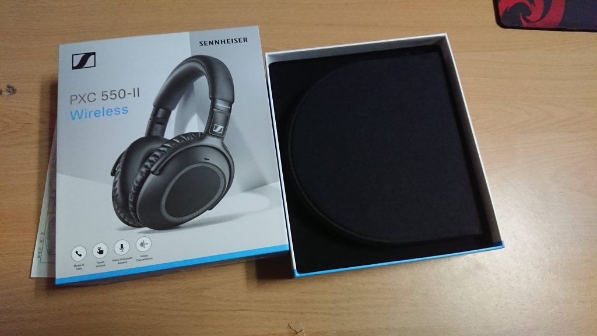

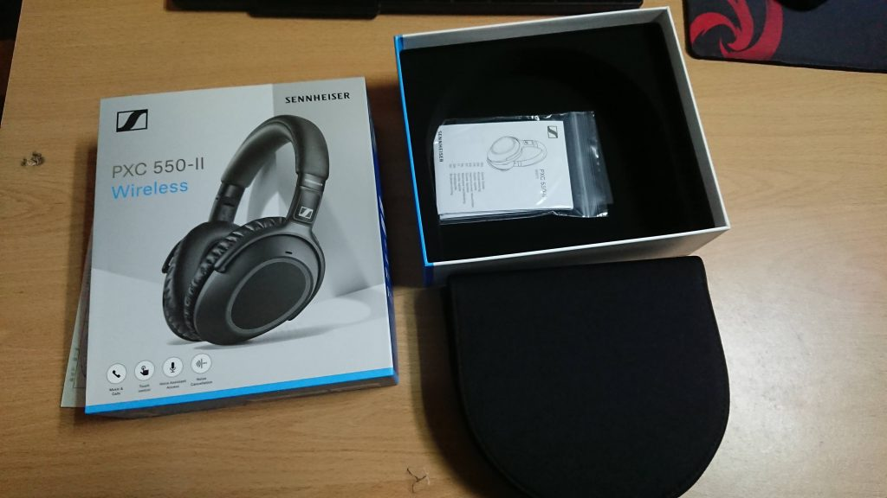

裡面有說明書跟一個軟的收納盒

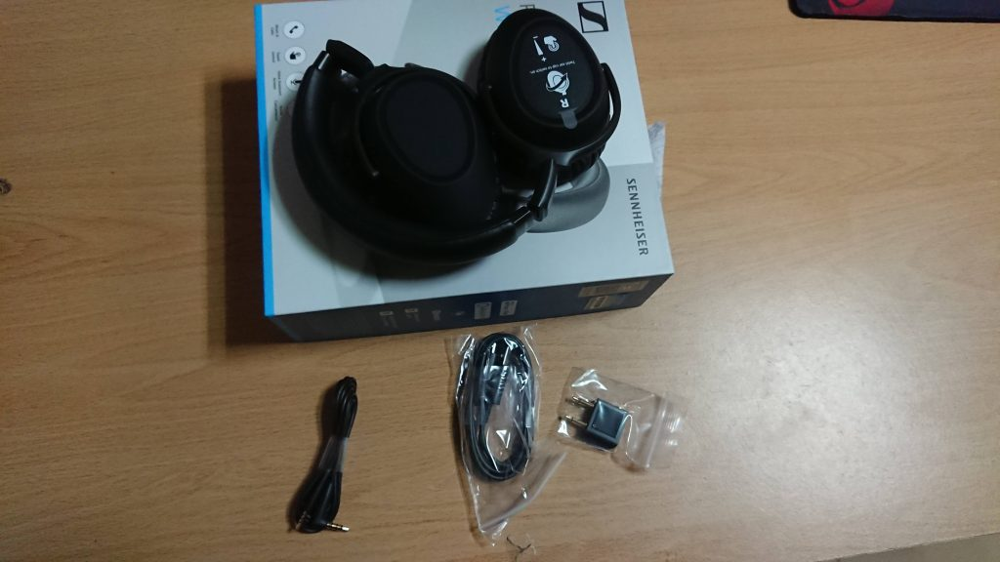

可以收納成那麼小 真的方便

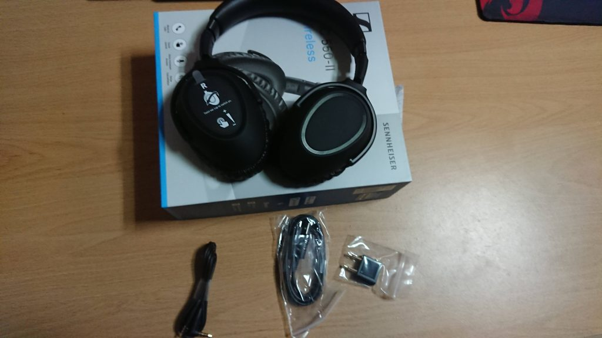

裡面會付micro-usb充電線 2.5mm轉3.5mm的轉接線 飛機上的轉接頭

## 使用一個禮拜感想

在聽的感覺上面可能每個人不一樣，所以我會著重在使用上面

### 舒適度

PXC 550 II很輕巧，戴在頭上完全沒有問題，還有那個軟軟的耳罩真的沒甚麼怨言，像我帶著眼鏡也沒什麼問題，硬要說的話一開始用的時候滿夾頭的，不過大概戴了3天之後感覺就還好了

### 方便度

他有一個APP可以設定一些功能，像是可以偵測你拿下耳機之後會自動停止音樂，這個功能用在手機上滿正常的，但是電腦的場合就不是那麼方便了，因為他的功能不是Start Stop而是toogle，代表你如果音樂本來就是沒有播放的狀態下你把它拿下來他反而會撥放，然後你戴上去之後她會停止，所以後來我就把這功能拿掉，這個功能可能會比較適合在旅行的人吧，至少對我來說是用不到

他的右耳部分有一個觸控區，可以控制音量跟切換歌，還有就是開啟通透模式，這個模式是滿方便的，這些功能在手機跟電腦都是正常的

### 藍芽功能

這耳機藍芽版本是5.0這代表如果你的另一個裝置也是5.0那麼傳輸的速度會更快然後可以使用的距離也會更遠，當然這也要你另一個裝置支援

這支耳機支援aptx LL，可以大幅降低延遲，我在使用上幾乎感覺不到延遲，拿來打音GAME也不是問題，我電腦上藍芽發射器是使用bt-w2雖然這個發射器沒有藍芽5.0但是支援aptx LL這對我來說就夠了，之後可能也考慮入手DG60來體驗看看藍芽5.0

上面也說過了PXC 550 II支援一次配對兩個裝置，但是我對這功能好像有點誤會了，我以為可以一次聽到兩個裝置的聲音，結果一次只會聽到一個裝置的聲音，但是像是手機有電話打來的話，他會馬上切過去手機那邊，這點真的滿方便的，但是切過去手機講完電話之後就不好切回來電腦了... 這個部分的確是個問題，對手機的切換是滿靈敏的，但是就會切不回原來的裝置，還好BT-W2有按鈕可以重新再連線，對我來說其實還好，也有可能是我使用方式不對才這樣，現在也想找個方案來解決這件事情ＸＤ

### 降噪功能

PXC 550 II的降噪有三個階段，簡單來說就是關掉、一半、全開，我個人是不太需要這個功能，畢竟不是在外面遊走，使用場景都在家裡，所以都都會關掉這功能，而且我自己不是很喜歡降噪的感覺，開起來如果不聽音樂會覺得很悶

以降噪效果來說我覺得SONY WH-1000XM3的降噪效果會比較好，根本是被開沉默的感覺一樣，當然聲海這支的效果也不錯，只是效果相較來說就沒有WH-1000XM3那麼好，不過我覺得真的也夠用了，以後有機會上飛機試試看效果的話我會再更新這部分ＸＤ

### 在電腦使用上

電腦使用上除了上面說的藍芽切換問題之外，還有一個就是我一直以為PXC 550 II的麥克風可以直接用，是可以直接用沒錯，但是開啟麥克風之後耳機好像會進入通話模式，整個音質就跑掉了，而且我還找不到設定可以改善這個部分，看來有點像是寫死的功能，所以現在我會買一個便宜的桌麥來用，當然在手機接聽電話還是使用耳機的麥克風，畢竟這才是他本來的用途，然後不得不說他的通話品質真的很不錯，收音都很清楚，還會幫你濾掉環境雜音

## 音樂表現

這部分我只能說去現場試聽，因為每個人的感覺不同，除非你要鍵盤試聽決定ＸＤ

不過還是講一下自己在聽了一個月之後的聽感

> 個人覺得這隻耳機偏冷，三頻均衡，解析度不錯，但我覺得有時候背景的樂器有時候會有蓋過人聲的感覺，然後低頻對我來說些許的不足，像[SONY WH 1000XM3](https://shopsquare.co/2iNVI "SONY WH 1000XM3")的低頻比較可以滿足我，不過比起以前的耳機可以聽到的細節多我就很滿足了，每次聽都會有彩蛋的感覺

## 結論

買這支以我來說不會後悔，雖然對不起錢包但是我自己很滿意，然後是SONY那支也是念念不忘，等他四代出了我可能會買來放辦公室聽
