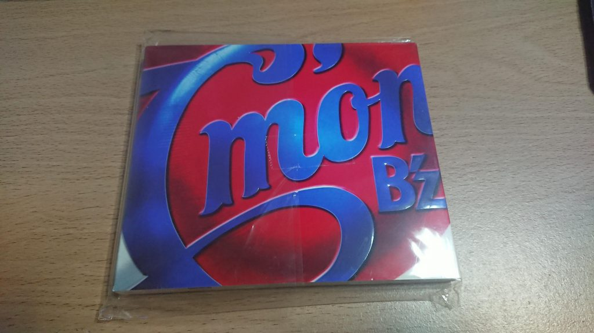
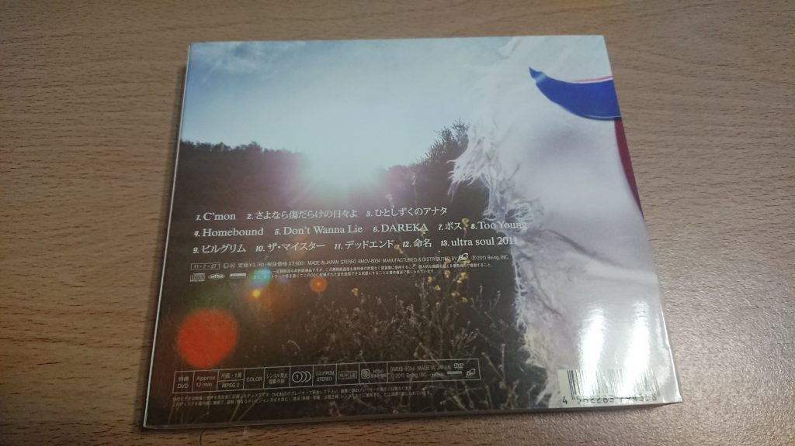
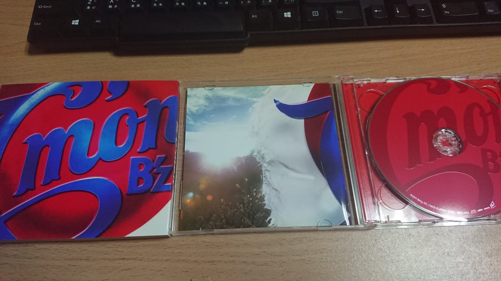

今天來推薦[B'z的C'mon](https://amzn.to/3lwfH0u "B'z的C'mon")這張專輯，這張是上次日本[海外代運](https://blog.devcker.com/leyifan-firsttime/ "海外代運")主要想買的專輯之一，自從被B'z燒到之後，就一直找串流有沒有B'z可以聽，結果都沒找到，好像是因為唱片公司授權的問題，所以當然只好收專輯了

對日本海外代運有興趣的可以參考我之前寫的這篇文章 [第一次用樂一番買日本專輯 流程跟心得](https://blog.devcker.com/leyifan-firsttime/ "第一次用樂一番買日本專輯 流程跟心得")

## 專輯圖片

## 曲目

1.  C'mon
2.  さよなら傷だらけの日々よ
3.  ひとしずくのアナタ
4.  Homebound
5.  Don't Wanna Lie
6.  DAREKA
7.  BOSS（ボス）
8.  Too Young
9.  Pilgrim（ピルグリム）
10.  The ‧ Meister（ザ・マイスター）
11.  Dead End（デッドエンド）
12.  命名
13.  ultra soul 2011

以上曲目擷取自[Wiki](https://zh.wikipedia.org/wiki/C%27mon "Wiki")

## 分享

這張最喜歡的歌應該是Too Young，稻葉的唱法真的會讓人著迷，每次聽到他在吼心情機會激昂起來，這可能也是我喜歡B'z的原因之一

## Too Young

這首在youtube上找不到，都只能找到別人翻唱的，如果想聽的朋友建議可以入手這張專輯聽聽看

## ultra soul

說到B'z就會想到這首，hey hey hey的ultra soul，竟然這張有這首就來推一下

## 結論

打從被B'z燒到好像只能注定買專輯了，不管是串流還是數位的，不是沒有上串流就是只有賣320k的版本，如果mora上有hi res版的話，我還真想直接都買下來

這張現在買二手也很便宜，不管台灣還是日本都找得到賣家

> AMAZON JP: [C'mon](https://amzn.to/34IVw9p "C'mon")
> 
> 日本樂天: [C'mon](https://hb.afl.rakuten.co.jp/ichiba/1da4ff16.47c4b415.1da4ff17.04c7ce40/?pc=https%3A%2F%2Fproduct.rakuten.co.jp%2Fproduct%2F-%2F182649bd754f31e43123378ea108411a%2F&link_type=hybrid_url&ut=eyJwYWdlIjoiaXRlbSIsInR5cGUiOiJoeWJyaWRfdXJsIiwic2l6ZSI6IjI0MHgyNDAiLCJuYW0iOjEsIm5hbXAiOiJyaWdodCIsImNvbSI6MSwiY29tcCI6ImRvd24iLCJwcmljZSI6MCwiYm9yIjoxLCJjb2wiOjEsImJidG4iOjEsInByb2QiOjEsImFtcCI6ZmFsc2V9 "C'mon")