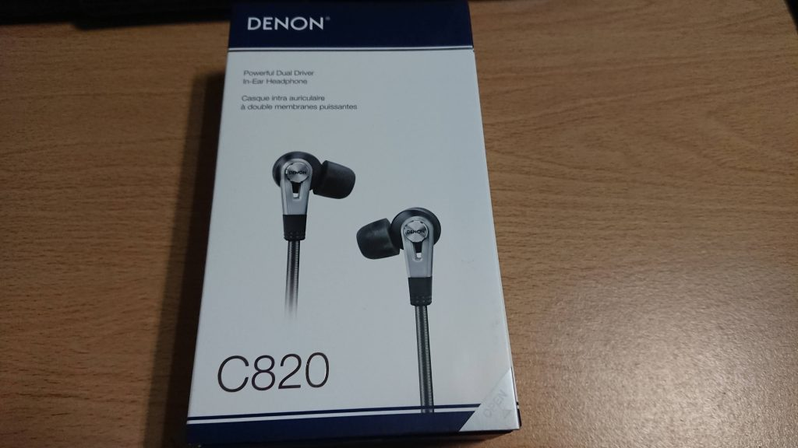
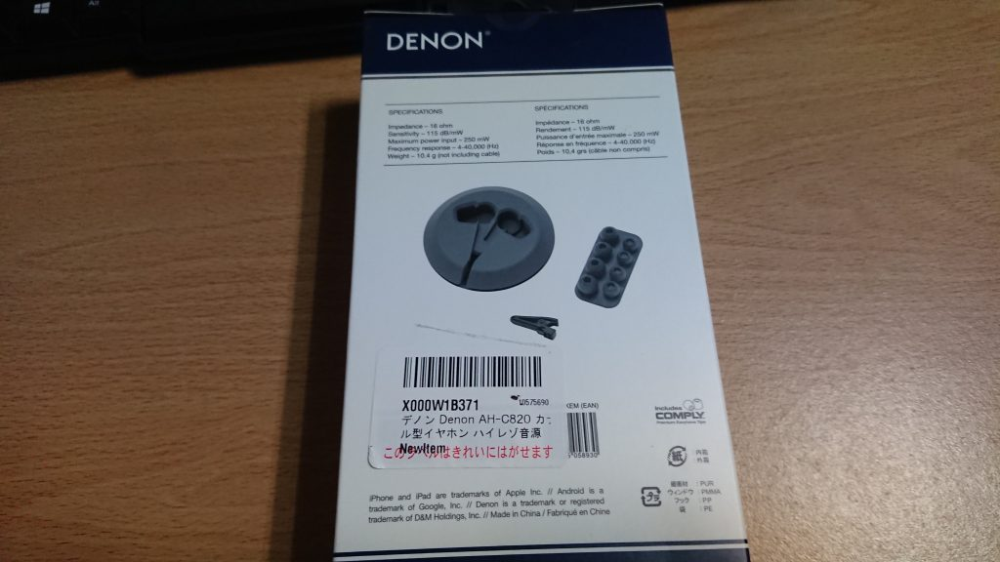
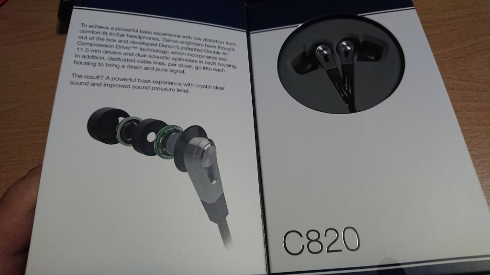
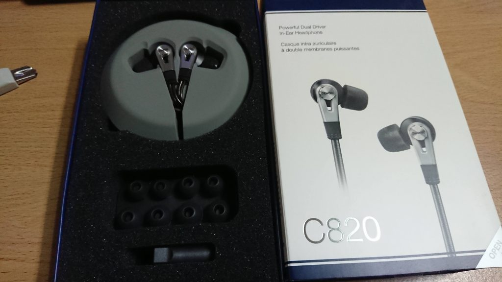

這隻耳機從網路上看到各種評價之後就想很久了，之前就直接跑去耳機店試聽，發現真的是我的菜，但是[台灣](https://shopsquare.co/2o7oO "台灣")賣的價格是有點貴，所以我就另尋管道去[日亞](https://amzn.to/38HDdnK "日亞")直接上了一隻用[轉運](https://blog.devcker.com/second-time-used-leyifan-experience/ "代運")運回來台灣，目前已經使用一個禮拜，已經很接近當初去試聽的聲音

要看當初轉運的文章可以到這邊: [第二次用樂一番轉運使用體驗](https://blog.devcker.com/second-time-used-leyifan-experience/ "第二次用樂一番轉運使用體驗")

## 開箱

正面照

背面

打開封面之後就能看到耳機本體，跟一些設計理念之類的文字

把底部的膠帶用美工刀割開後拉出來，就能看到耳機跟幾個附贈的耳塞

## 配戴感

網路上找了很多缺點都是配戴感，我自己的感覺是一開始會覺得好像有點大，而且又是用海綿塞，一開始塞進耳朵會感覺有一個異物感，但是戴習慣之後，我自己是不太在意這問題了，可能海綿塞已經變成我耳朵的形狀了吧XD

基於這點真的建議要去耳機店試戴看看，我自己也覺得配戴感是滿重要的，會影響後來聽這隻耳機的感覺

## 開聲

拿下耳機之後我就直接接上我的手機來聽了，第一次的聲音沒有之前在耳機店聽的解析跟低頻，但是會因為音場的關係還是會覺得這是個好耳機，在網路上找了一下之後大家也都說要run個幾十小時本體聲音才會出現

## run了一個禮拜的聽感

果不其然，拿到後的一整個禮拜，一上班就開始拿起來聽，大概聽到第三天就可以發現低頻跟解析出來了，就是那個我要的聲音，就是他，但是高音的部分有些歌還是會有點刺刺的，但是有這個低頻跟解析，聽金屬真的有差

到了禮拜五最後一個上班天，大概聽到中午休息一下，下午再拿起來聽的時候，發現高音會刺的現象有變少很多，雖然還是有，但是我已經很滿意了

再來就是他的音場，我應該是第一次聽到音場大的耳機，所以感覺有點新鮮，這隻應該也滿適合拿來看電影的，震撼度之類的我覺得都滿不錯的

## 我覺得[C820](https://amzn.to/38HDdnK "C820")適合的音樂

我自己本身聽jpop跟金屬比較多，特別是最近都在聽金屬，所以才會找到這一隻

先說，這隻拿來聽金屬跟搖滾真的很適合，低頻不會太轟，而且解析根本就是亮點，我自己認為非常適合拿來聽金屬，特別是鞭金，速度金，聽起來就是爽而已

再來就是jpop的部分，網路上有看到滿多人說沒那麼適合流行音樂特別是女聲，但就以我自己的感覺來說，我覺得還算滿ok的，女聲也不會說太糟糕，頂多只是因為音場大，所以人聲會感覺有點遠，不然我覺得這隻拿來聽流行音樂真的不算差

最後應該就是遊戲或電影原聲帶了，我自己雖然不常聽，但是滿常玩遊戲的，所以還是有喜歡的原聲帶，我自己是拿下面兩首來試

這邊[C820](https://amzn.to/38HDdnK "C820")的音場真的是恰到好處，我自己覺得很適合拿來聽這種原聲帶

## 加上小尾巴的聽感

這隻在直推上我覺得就很不錯，但後來買了小尾巴可以參考看看 [微開箱 小尾巴DAC KUANG PAI 狂派Plus2](https://blog.devcker.com/kuang-pai-dac/ "微開箱 小尾巴DAC KUANG PAI 狂派Plus2")

## 結論

這隻真的是一隻好耳機，我超級滿意，不過可能也是我聽過的耳機太少XD，但是這隻如果喜歡聽金屬或搖滾，然後是直接插手機的話，我大推，不過建議還是自己去一趟耳機店聽聽看會比較好，其實我原本目標是另外一隻，[C820](https://amzn.to/38HDdnK "C820")是順便聽的XD，但是聽完之後，就決定是他的感覺

這隻在台灣價格是有點貴，但是有多保固，這個就要自己斟酌了

## 購買管道

以下都是參考而已，可以用比價網多多比價再做決定

台灣：

> 比價：[https://biggo.com.tw/s/?q=c820](https://biggo.com.tw/s/?q=c820)
> 
> 公司貨: [購買連結](https://shopsquare.co/2o7oO "購買連結")
> 
> 水貨: [購買連結](https://r10.to/hl8NPS "購買連結")

日本:

> 比價：[https://kakaku.com/item/K0000904186/?lid=pc\_ksearch\_kakakuitem](https://kakaku.com/item/K0000904186/?lid=pc_ksearch_kakakuitem)
> 
> 日本AMAZON: [デノン Denon AH-C820 カナル型イヤホン ハイレゾ音源対応/デュアルドライバー ブラック AH-C820-BK](https://amzn.to/38HDdnK "デノン Denon AH-C820 カナル型イヤホン ハイレゾ音源対応/デュアルドライバー ブラック AH-C820-BK ")
> 
> 日本樂天: [DENON デノン AH-C820BKEM（ブラック）【送料無料】ハイグレードOFCケーブル採用カナル型 イヤホン イヤフォン 【1年保証】](https://hb.afl.rakuten.co.jp/ichiba/1da4ff16.47c4b415.1da4ff17.04c7ce40/?pc=https%3A%2F%2Fproduct.rakuten.co.jp%2Fproduct%2F-%2F22ed26d4dbf929a16e5a2ff8be857bfa%2F&link_type=text&ut=eyJwYWdlIjoiaXRlbSIsInR5cGUiOiJ0ZXh0Iiwic2l6ZSI6IjI0MHgyNDAiLCJuYW0iOjEsIm5hbXAiOiJyaWdodCIsImNvbSI6MSwiY29tcCI6ImRvd24iLCJwcmljZSI6MCwiYm9yIjoxLCJjb2wiOjEsImJidG4iOjEsInByb2QiOjEsImFtcCI6ZmFsc2V9)